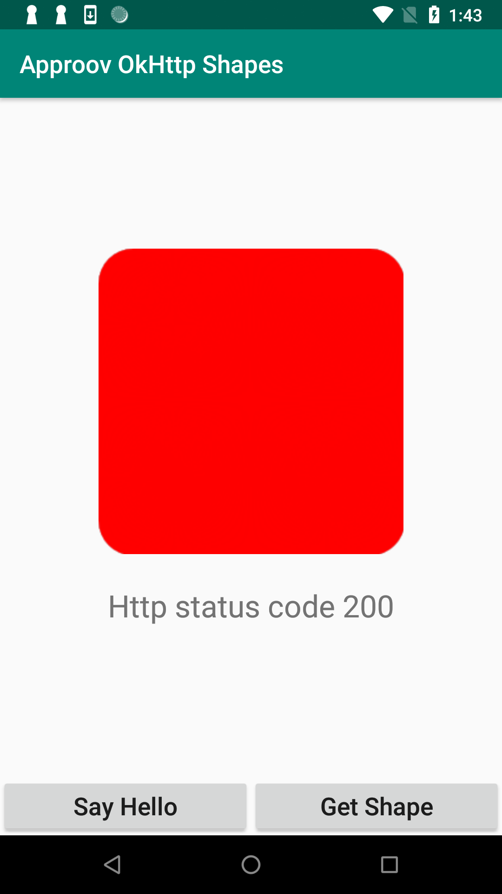

# Approov Quickstart: Android Java Retrofit

This quickstart is written specifically for native Android apps that are written in Java and use [`Retrofit`](https://square.github.io/retrofit/) for making the API calls that you wish to protect with Approov. If this is not your situation then check if there is a more relevant Quickstart guide available.

## WHAT YOU WILL NEED
* Access to a trial or paid Approov account
* The `approov` command line tool [installed](https://approov.io/docs/latest/approov-installation/) with access to your account
* [Android Studio](https://developer.android.com/studio) installed (version 3.5.2 is used in this guide)
* The contents of the folder containing this README

## WHAT YOU WILL LEARN
* How to integrate Approov into a real app in a step by step fashion
* How to register your app to get valid tokens from Approov
* A solid understanding of how to integrate Approov into your own app that uses Java and [Retrofit](https://square.github.io/retrofit/)
* Some pointers to other Approov features

## RUNNING THE SHAPES APP WITHOUT APPROOV

Open the project in the `shapes-app` folder using `File->Open` in Android Studio.

Ensure that the currently active build variant is `debug` and then build an APK as follows:


The following dialog will popup when the build is complete:


Click on `locate` to get the `app-debug.apk` location, and the file explorer window will open. Now you need to open the terminal of your operating system on this location and execute:
```
$ adb install app-debug.apk
```
> **NOTE**:
>   * The [`adb`](https://developer.android.com/studio/command-line/adb) tool needs to be installed in in your `$PATH`.
>   * The mobile device needs to be in Developer mode, and USB debugging needs to be [enabled](https://developer.android.com/studio/command-line/adb#Enabling) and set to always trust in your device.

From the mobile device launch the app and you will see two buttons:

<p>
    
</p>

Click on the `Say Hello` button and you should see this:

<p>
    
</p>

This checks the connectivity by connecting to the endpoint `https://shapes.approov.io/v1/hello`. Now press the `Get Shape` button and you will see this:

<p>
    
</p>

This contacts `https://shapes.approov.io/v2/shapes` to get the name of a random shape. It gets the status code 400 (`Bad Request`) because this endpoint is protected with an Approov token. Next, you will add Approov into the app so that it can generate valid Approov tokens and get shapes.

## ADD THE APPROOV SDK

Get the latest Approov SDK (if you are using Windows then substitute `approov` with `approov.exe` in all cases in this quickstart)
```
$ approov sdk -getLibrary approov-sdk.aar
```
Right-click on the `app` folder in the `Android` tab and select `New->Module`:


Select the`Import .JAR/.AAR` option and click `Next`:


Select the path of the `approov-sdk.aar` file you saved earlier:


You may cancel any request to add the module to the `git` repository. Right-click on the `app` module and select `Open Module Settings`:


Select `Dependencies`, then the `app` and then add a `Module Dependency` by clicking the + sign:


Select `approov-sdk` and click `OK`:


The Approov SDK is now included as a dependency in your project.

## ADD THE APPROOV FRAMEWORK CODE

The folder `framework` has a `src/main/java/io/approov/framework/retrofit/ApproovService.java` file. This provides a wrapper around the Approov SDK itself to make it easier to use with `Retrofit`. Show the terminal in Android Studio by clicking on the `Terminal` tab, typically located at the bottom of the screen:


This should have a current folder in the `shapes-app`. You need to copy the folder `framework`, retaining its path, into the `app` subdirectory of the project.

#### unix:
```
$ cp -r ../framework/src/main/java/io/approov/framework app/src/main/java/io/approov
```

#### windows:
```
$ powershell -Command "Copy-Item -Path '..\framework\src\main\java\io\approov\framework' -Destination 'app\src\main\java\io\approov' -Recurse"
```
> **NOTE:** When running directly on a PowerShell terminal you can drop the prefix `powershell -Command ""`.

Click on `java` in the `project` pane and the code should be included as follows:


## ENSURE THE SHAPES API IS ADDED

In order for Approov tokens to be generated for `https://shapes.approov.io/v2/shapes` it is necessary to inform Approov about it. If you are using a demo account this is unnecessary as it is already setup. For a trial account do:
```
$ approov api -add shapes.approov.io
```
Tokens for this domain will be automatically signed with the specific secret for this domain, rather than the normal one for your account.

## SETUP YOUR APPROOV CONFIGURATION

The Approov SDK needs a configuration string to identify the account associated with the app. Obtain it using:
```
$ approov sdk -getConfig initial-config.txt
```
Copy and paste the `initial-config.txt` file content into a new created `approov_config` string resource entry as shown (the actual entry will be much longer than shown).


The app reads this string to initialize the Approov SDK.

## MODIFY THE APP TO USE APPROOV

Uncomment the three lines of Approov initialization code in `ShapesApp`:


This initializes Approov when the app is first created. It uses the configuration string we set earlier. A `public static` member allows other parts of the app to access the singleton Approov instance. All calls to `ApproovService` and the SDK itself are thread safe.

Next we need to use Approov when we create a retrofit instance to access shapes. We change the lazy constructor for the instance:


Instead of constructing the `Retrofit` object lazily here we construct the builder for it instead and provide that to the `ApproovService`. It maintains a cache of `Retrofit` objects constructed with different builders. Thus there may be many retrofit construction classes in your app (likely with different base URLs) that can all use the same underlying `ApproovService` singleton.

The `ApproovService` constructs a custom `OkHttpClient` that adds the `Approov-Token` header and also applies pinning for the connections to ensure that no Man-in-the-Middle can eavesdrop on any communication being made. If the pins are changed then a new `Retrofit` instance is automatically created.

## REGISTER YOUR APP WITH APPROOV

In order for Approov to recognize the app as being valid it needs to be registered with the service. Ensure that the currently active build variant is `debug` and then build an APK as follows:


The following dialog will popup when the build is complete:


Click on `locate` to get the `app-debug.apk` location. Register the app with Approov:
```
$ approov registration -add app-debug.apk
```

## RUNNING THE SHAPES APP WITH APPROOV

Install the `app-debug.apk` that you just registered on the device. You will need to remove the old app from the device first.
```
$ adb install -r app-debug.apk
```
Launch the app and press the `Get Shape` button. You should now see this (or another shape):

<p>
    
</p>

This means that the app is getting a validly signed Approov token to present to the shapes endpoint.

## WHAT IF I DON'T GET SHAPES

If you still don't get a valid shape then there are some things you can try. Remember this may be because the device you are using has some characteristics that cause rejection for the currently set [Security Policy](https://approov.io/docs/latest/approov-usage-documentation/#security-policies) on your account:

* Ensure that the version of the app you are running is exactly the one you registered with Approov.
* If you running the app from a debugger then valid tokens are not issued.
* Look at the [`logcat`](https://developer.android.com/studio/command-line/logcat) output from the device. Information about any Approov token fetched or an error is output at the `INFO` level, e.g. `2020-02-10 13:55:55.774 10442-10705/io.approov.shapes I/ApproovInterceptor: Approov Token for shapes.approov.io: {"did":"+uPpGUPeq8bOaPuh+apuGg==","exp":1581342999,"ip":"1.2.3.4","sip":"R-H_vE"}`. You can easily [check](https://approov.io/docs/latest/approov-usage-documentation/#loggable-tokens) the validity.

If you have a trial (as opposed to demo) account you have some additional options:
* Consider using an [Annotation Policy](https://approov.io/docs/latest/approov-usage-documentation/#annotation-policies) during development to directly see why the device is not being issued with a valid token.
* Use `approov metrics` to see [Live Metrics](https://approov.io/docs/latest/approov-usage-documentation/#live-metrics) of the cause of failure.
* You can use a debugger and get valid Approov tokens on a specific device by [whitelisting](https://approov.io/docs/latest/approov-usage-documentation/#adding-a-device-security-policy).

## CHANGING YOUR OWN APP TO USE APPROOV

### Configuration

This quick start guide has taken you through the steps of adding Approov to the shapes demonstration app. If you have you own app using `Retrofit` you can follow exactly the same steps to add Approov. Take note of the dependency discussion [here](https://approov.io/docs/latest/approov-usage-documentation/#importing-the-approov-sdk-into-android-studio).

### API Domains
Remember you need to [add](https://approov.io/docs/latest/approov-usage-documentation/#adding-api-domains) all of the API domains that you wish to send Approov tokens for. You can still use the Approov `Retrofit` client for other domains, but no `Approov-Token` will be sent. 

### Custom OkHttp Client
The call to `<AppClass>.approovService.getRetrofit()` gets a cached retrofit client to be used for requests. This automatically includes an `OkHttp` interceptor to add the `Approov-Token` header and a `CertificatePinner` to pin the connections. You must always call this method whenever you want to construct a request to ensure that you are using the most up to date client. Failure to do this will mean that the app is not able to dynamically change its pins.

By default, this uses a default `OkHttp` client. However, your existing code may use a customized client with, for instance, different timeouts or other interceptors. For example, if you have existing code:
```
OkHttpClient client = new OkHttpClient.Builder().connectTimeout(5, TimeUnit.SECONDS).build();
retrofit = new retrofit2.Retrofit.Builder().baseUrl("my.domain/").client(client).build();
```
Pass the modified `OkHttp.Builder` to the `ApproovService` framework as follows:
```
<AppClass>.approovService.setOkHttpClientBuilder(new OkHttpClient.Builder().connectTimeout(5, TimeUnit.SECONDS));
retrofitBuilder = new retrofit2.Retrofit.Builder().baseUrl("my.domain/");
retrofit = <AppClass>.approovService.getRetrofit(retrofitBuilder);
```
The call to `setOkHttpClientBuilder` only needs to be made once. Subsequent calls to `<AppClass>.approovService.getRetrofit()` will then always a `OkHttpClient` with the builder values included.

### Preferences
An Approov app automatically downloads any new configurations of APIs and their pins that are available. These are stored in the [`SharedPreferences`](https://developer.android.com/reference/android/content/SharedPreferences) for the app in a preference file `approov-prefs` and key `approov-config`. You can store the preferences differently by modifying or overriding the methods `putApproovDynamicConfig` and `getApproovDynamicConfig` in `ApproovService.java`.

### Changing Your API Backend
The Shapes example app uses the API endpoint `https://shapes.approov.io/v2/shapes` hosted on Approov's servers. If you want to integrate Approov into your own app you will need to [integrate](https://approov.io/docs/latest/approov-usage-documentation/#backend-integration) an Approov token check. Since the Approov token is simply a standard [JWT](https://en.wikipedia.org/wiki/JSON_Web_Token) this is usually straightforward. [Backend integration](https://approov.io/docs/latest/approov-integration-examples/backend-api/) examples provide a detailed walk-through for particular languages. Note that the default header name of `Approov-Token` can be changed by editing `APPROOV_HEADER` in `ApproovService`. Moreover, a prefix to the header can be added in `APPROOV_TOKEN_PREFIX`. This is primarily for integrations where the JWT might need to be prefixed with `Bearer`, like the `Authorization` header.

### Token Prefetching
If you wish to reduce the latency associated with fetching the first Approov token, then a call to `ApproovService.prefetchApproovToken()` can be made immediately after initialization of the Approov SDK. This initiates the process of fetching an Approov token as a background task, so that a cached token is available immediately when subsequently needed, or at least the fetch time is reduced. Note that if this feature is being used with [Token Binding](https://approov.io/docs/latest/approov-usage-documentation/#token-binding) then the binding must be set prior to the prefetch, as changes to the binding invalidate any cached Approov token.

## NEXT STEPS

This quick start guide has shown you how to integrate Approov with your existing app. Now you might want to explore some other Approov features:

* Managing your app [registrations](https://approov.io/docs/latest/approov-usage-documentation/#managing-registrations)
* Manage the [pins](https://approov.io/docs/latest/approov-usage-documentation/#public-key-pinning-configuration) on the API domains to ensure that no Man-in-the-Middle attacks on your app's communication are possible.
* Update your [Security Policy](https://approov.io/docs/latest/approov-usage-documentation/#security-policies) that determines the conditions under which an app will be given a valid Approov token.
* Learn how to [Manage Devices](https://approov.io/docs/latest/approov-usage-documentation/#managing-devices) that allows you to change the policies on specific devices.
* Understand how to provide access for other [Users](https://approov.io/docs/latest/approov-usage-documentation/#user-management) of your Approov account.
* Use the [Metrics Graphs](https://approov.io/docs/latest/approov-usage-documentation/#metrics-graphs) to see live and accumulated metrics of devices using your account and any reasons for devices being rejected and not being provided with valid Approov tokens. You can also see your billing usage which is based on the total number of unique devices using your account each month.
* Use [Service Monitoring](https://approov.io/docs/latest/approov-usage-documentation/#service-monitoring) emails to receive monthly (or, optionally, daily) summaries of your Approov usage.
* Consider using [Token Binding](https://approov.io/docs/latest/approov-usage-documentation/#token-binding). The method `<AppClass>.approovService.setBindingHeader` takes the name of the header holding the value to be bound. This only needs to be called once but the header needs to be present on all API requests using Approov.
* Learn about [automated approov CLI usage](https://approov.io/docs/latest/approov-usage-documentation/#automated-approov-cli-usage).
* Investigate other advanced features, such as [Offline Security Mode](https://approov.io/docs/latest/approov-usage-documentation/#offline-security-mode), [SafetyNet Integration](https://approov.io/docs/latest/approov-usage-documentation/#google-safetynet-integration) and [Android Automated Launch Detection](https://approov.io/docs/latest/approov-usage-documentation/#android-automated-launch-detection).


