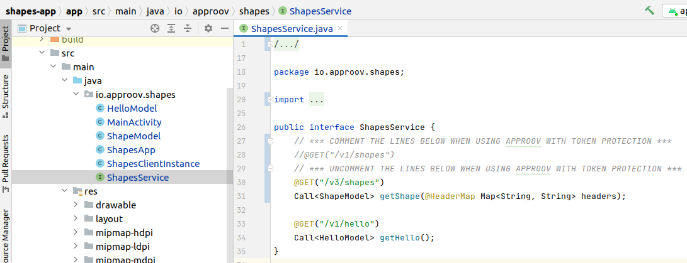
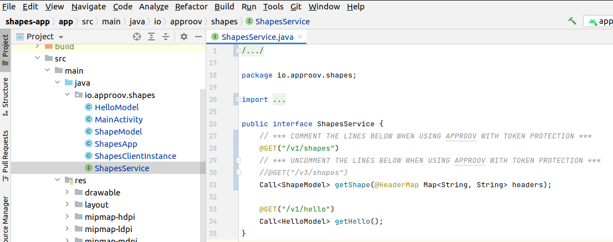
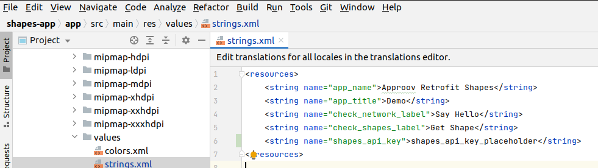
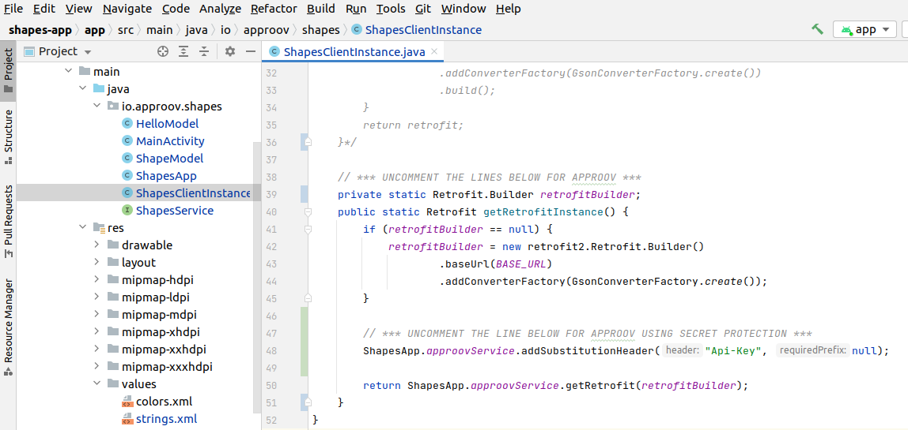

# Shapes Example

This quickstart is written specifically for native Android apps that are written in Java and use [`Retrofit`](https://square.github.io/retrofit/) for making the API calls that you wish to protect with Approov. This quickstart provides a step-by-step example of integrating Approov into an app using a simple `Shapes` example that shows a geometric shape based on a request to an API backend that can be protected with Approov.

## WHAT YOU WILL NEED
* Access to a trial or paid Approov account
* The `approov` command line tool [installed](https://approov.io/docs/latest/approov-installation/) with access to your account
* [Android Studio](https://developer.android.com/studio) installed (Android Studio Bumblebee 2021.1.1 is used in this guide)
* The contents of this repo

## RUNNING THE SHAPES APP WITHOUT APPROOV

Open the project in the `shapes-app` folder using `File->Open` in Android Studio. Run the app as follows:


You will see two buttons:

<p>
    
</p>

Click on the `Say Hello` button and you should see this:

<p>
    
</p>

This checks the connectivity by connecting to the endpoint `https://shapes.approov.io/v1/hello`. Now press the `Get Shape` button and you will see this (or another shape):

<p>
    
</p>

This contacts `https://shapes.approov.io/v1/shapes` to get the name of a random shape. This endpoint is protected with an API key that is built into the code, and therefore can be easily extracted from the app.

## ADD THE APPROOV DEPENDENCY

The Approov integration is available via [`jitpack`](https://jitpack.io). This allows inclusion into the project by simply specifying a dependency in the `gradle` files for the app. Firstly, `jitpack` needs to be added as follows to the end the `repositories` section in the `build.gradle:20` file at the top level of the project:

```
maven { url 'https://jitpack.io' }
```


The `approov-service-retrofit` dependency needs to be added as follows to the `app/build.gradle:38` at the app level:


Note that in this case the dependency has been added with the tag `main-SNAPSHOT`. We recommend you add a dependency to a specific version:

```
implementation 'com.github.approov:approov-service-retrofit:3.1.0'
```

Make sure you do a Gradle sync (by selecting `Sync Now` in the banner at the top of the modified `.gradle` file) after making these changes.

Note that `approov-service-retrofit` is actually an open source wrapper layer that allows you to easily use Approov with `Retrofit`. This has a further dependency to the closed source Approov SDK itself.

## ENSURE THE SHAPES API IS ADDED

In order for Approov tokens to be generated for `shapes.approov.io` it is necessary to inform Approov about it:
```
approov api -add shapes.approov.io
```
Tokens for this domain will be automatically signed with the specific secret for this domain, rather than the normal one for your account.

## MODIFY THE APP TO USE APPROOV

Uncomment the three lines of Approov initialization code in `io/approov/shapes/ShapesApp.java`:


This initializes Approov when the app is first created. It uses the configuration string we set earlier.

The Approov SDK needs a configuration string to identify the account associated with the app. It will have been provided in the Approov onboarding email (it will be something like `#123456#K/XPlLtfcwnWkzv99Wj5VmAxo4CrU267J1KlQyoz8Qo=`). Copy this into `io/approov/shapes/ShapesApp.java`, replacing the text `<enter-your-config-string-here>`.

Next we need to use Approov when we create a retrofit instance to access shapes. We change the lazy constructor for the instance at `io/approov/shapes/ShapesClientInstance.java`:


> **NOTE:** Don't forget to comment out the previous block of code, and also to uncomment the required `import` statement.

Instead of constructing the `Retrofit` object lazily here we construct the builder for it instead and provide that to the `ApproovService`. It maintains a cache of `Retrofit` objects constructed with different builders. Thus there may be many retrofit construction classes in your app (likely with different base URLs) that can all use the same underlying `ApproovService` singleton.

The `ApproovService` constructs a custom `OkHttpClient` that adds the `Approov-Token` header and also applies pinning for the connections to ensure that no Man-in-the-Middle can eavesdrop on any communication being made. If the pins are changed then a new `Retrofit` instance is automatically created.

You should edit the `ShapesService.java` file to change to using the shapes `https://shapes.approov.io/v3/shapes/` endpoint. This checks Approov tokens (as well as the API key built into the app):



Run the app again to ensure that the `app-debug.apk` in the generated build outputs is up to date.

## ADD YOUR SIGNING CERTIFICATE TO APPROOV

In order for Approov to recognize the app as being valid, the local certificate used to sign the app needs to be added to Approov. The following assumes it is in PKCS12 format:

```
approov appsigncert -add ~/.android/debug.keystore -storePassword android -autoReg
```

This ensures that any app signed with the certificate used on your development machine will be recognized by Approov. See [Android App Signing Certificates](https://approov.io/docs/latest/approov-usage-documentation/#android-app-signing-certificates) if your keystore format is not recognized or if you have any issues adding the certificate.

> **IMPORTANT:** The addition takes up to 30 seconds to propagate across the Approov Cloud Infrastructure so don't try to run the app again before this time has elapsed.

## SHAPES APP WITH APPROOV API PROTECTION

Run the app again without making any changes to the app and press the `Get Shape` button. You should now see this (or another shape):

<p>
    
</p>

This means that the app is getting a validly signed Approov token to present to the shapes endpoint.

> **NOTE:** Running the app on an emulator will not provide valid Approov tokens. You will need to always pass the device (see below).

## WHAT IF I DON'T GET SHAPES

If you still don't get a valid shape then there are some things you can try. Remember this may be because the device you are using has some characteristics that cause rejection for the currently set [Security Policy](https://approov.io/docs/latest/approov-usage-documentation/#security-policies) on your account:

* Ensure that the version of the app you are running is signed with the correct certificate.
* Look at the [`logcat`](https://developer.android.com/studio/command-line/logcat) output from the device. Information about any Approov token fetched or an error is output at the `DEBUG` level. You can easily [check](https://approov.io/docs/latest/approov-usage-documentation/#loggable-tokens) the validity and find out any reason for a failure.
* Use `approov metrics` to see [Live Metrics](https://approov.io/docs/latest/approov-usage-documentation/#live-metrics) of the cause of failure.
* You can use a debugger or emulator and get valid Approov tokens if you [mark the signing certificate as being for development](https://approov.io/docs/latest/approov-usage-documentation/#development-app-signing-certificates).

## SHAPES APP WITH SECRETS PROTECTION

This section provides an illustration of an alternative option for Approov protection if you are not able to modify the backend to add an Approov Token check. Firstly, revert any previous change to `ShapesService.java` so that it uses `https://shapes.approov.io/v1/shapes/`. This endpoiint simply checks for an API key:



Next, the `res/values/strings.xml` file needs to be changed with the `shapes_api_key` entry modified to `shapes_api_key_placeholder`. This removes the actual API key out of the code:



You must inform Approov that it should map `shapes_api_key_placeholder` to `yXClypapWNHIifHUWmBIyPFAm` (the actual API key) in requests as follows:

```
approov secstrings -addKey shapes_api_key_placeholder -predefinedValue yXClypapWNHIifHUWmBIyPFAm
```

> Note that this command also requires an [admin role](https://approov.io/docs/latest/approov-usage-documentation/#account-access-roles).

Next we need to inform Approov that it needs to substitute the placeholder value for the real API key on the `Api-Key` header. Only a single line of code needs to be changed at `io/approov/shapes/ShapesClientInstance.java`:



Build and run the app again and press the `Get Shape` button. You should now see this (or another shape):

<p>
    
</p>

This means that the app is able to access the API key, even though it is no longer embedded in the app configuration, and provide it to the shapes request.
