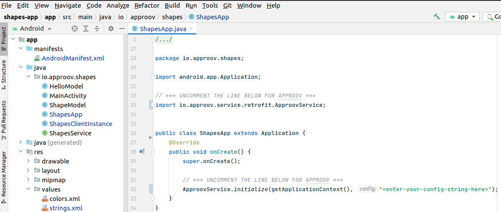
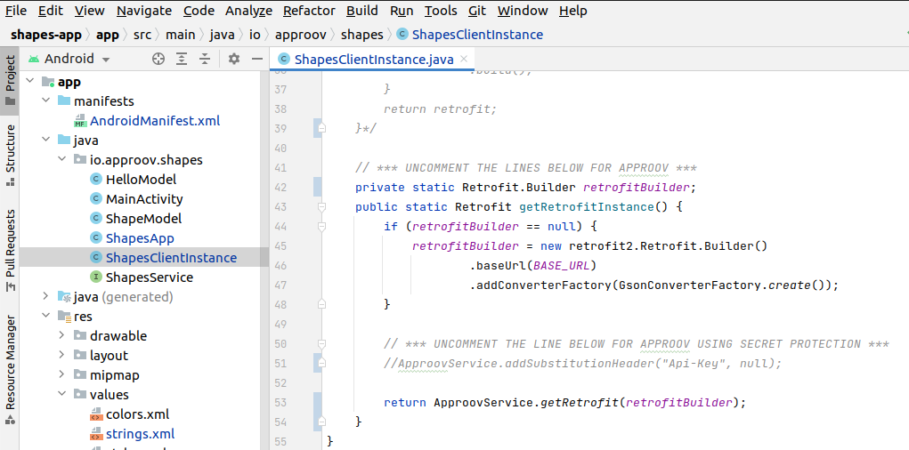

# Shapes Example

This quickstart is written specifically for native Android apps that are written in Java and use [`Retrofit`](https://square.github.io/retrofit/) for making the API calls that you wish to protect with Approov. This quickstart provides a step-by-step example of integrating Approov into an app using a simple `Shapes` example that shows a geometric shape based on a request to an API backend that can be protected with Approov.

## WHAT YOU WILL NEED
* Access to a trial or paid Approov account
* The `approov` command line tool [installed](https://approov.io/docs/latest/approov-installation/) with access to your account
* [Android Studio](https://developer.android.com/studio) installed (version 4.1.2 is used in this guide)
* The contents of this repo

## RUNNING THE SHAPES APP WITHOUT APPROOV

Open the project in the `shapes-app` folder using `File->Open` in Android Studio. Run the app as follows:


You will see two buttons:

<p>
    
</p>

Click on the `Say Hello` button and you should see this:

<p>
    
</p>

This checks the connectivity by connecting to the endpoint `https://shapes.approov.io/v1/hello`. Now press the `Get Shape` button and you will see this:

<p>
    
</p>

This contacts `https://shapes.approov.io/v2/shapes` to get the name of a random shape. It gets the status code 400 (`Bad Request`) because this endpoint is protected with an Approov token. Next, you will add Approov into the app so that it can generate valid Approov tokens and get shapes.

## ADD THE APPROOV DEPENDENCY

The Approov integration is available via [`jitpack`](https://jitpack.io). This allows inclusion into the project by simply specifying a dependency in the `gradle` files for the app. Firstly, `jitpack` needs to be added as follows to the end the `repositories` section in the `build.gradle:20` file at the top level of the project:

```
maven { url 'https://jitpack.io' }
```


The `approov-service-retrofit` dependency needs to be added as follows to the `app/build.gradle:38` at the app level:


Note that in this case the dependency has been added with the tag `main-SNAPSHOT`. We recommend you add a dependency to a specific version:

```
implementation 'com.github.approov:approov-service-retrofit:2.7.0'
```

Make sure you do a Gradle sync (by selecting `Sync Now` in the banner at the top of the modified `.gradle` file) after making these changes.

Note that `approov-service-retrofit` is actually an open source wrapper layer that allows you to easily use Approov with `Retrofit`. This has a further dependency to the closed source Approov SDK itself.

## ENSURE THE SHAPES API IS ADDED

In order for Approov tokens to be generated for `https://shapes.approov.io/v2/shapes` it is necessary to inform Approov about it:
```
approov api -add shapes.approov.io
```
Tokens for this domain will be automatically signed with the specific secret for this domain, rather than the normal one for your account.

## MODIFY THE APP TO USE APPROOV

Uncomment the three lines of Approov initialization code in `io/approov/shapes/ShapesApp.java`:



This initializes Approov when the app is first created. It uses the configuration string we set earlier. A `public static` member allows other parts of the app to access the singleton Approov instance. All calls to `ApproovService` and the SDK itself are thread safe.

The Approov SDK needs a configuration string to identify the account associated with the app. It will have been provided in the Approov onboarding email (it will be something like `#123456#K/XPlLtfcwnWkzv99Wj5VmAxo4CrU267J1KlQyoz8Qo=`). Copy this into `io/approov/shapes/ShapesApp.java:36`, replacing the text `<enter-your-config-string-here>`.

Next we need to use Approov when we create a retrofit instance to access shapes. We change the lazy constructor for the instance at `io/approov/shapes/ShapesClientInstance.java:40`:



> **NOTE:** Don't forget to comment out the previous block of code.

Instead of constructing the `Retrofit` object lazily here we construct the builder for it instead and provide that to the `ApproovService`. It maintains a cache of `Retrofit` objects constructed with different builders. Thus there may be many retrofit construction classes in your app (likely with different base URLs) that can all use the same underlying `ApproovService` singleton.

The `ApproovService` constructs a custom `OkHttpClient` that adds the `Approov-Token` header and also applies pinning for the connections to ensure that no Man-in-the-Middle can eavesdrop on any communication being made. If the pins are changed then a new `Retrofit` instance is automatically created.

Run the app again to ensure that the `app-debug.apk` in the generated build outputs is up to date.

## REGISTER YOUR APP WITH APPROOV

In order for Approov to recognize the app as being valid it needs to be registered with the service. Change directory to the top level of the `shapes-app` project and then register the app with Approov:

```
approov registration -add app/build/outputs/apk/debug/app-debug.apk
```
Note, on Windows you need to substitute \ for / in the above command.

> **IMPORTANT:** The registration takes up to 30 seconds to propagate across the Approov Cloud Infrastructure, therefore don't try to run the app again before this time as elapsed. During development of your app you can ensure your device [always passes](https://approov.io/docs/latest/approov-usage-documentation/#adding-a-device-security-policy) so you do not have to register the APK each time you modify it.

## RUNNING THE SHAPES APP WITH APPROOV

Run the app again without making any changes to the app and press the `Get Shape` button. You should now see this (or another shape):

<p>
    
</p>

This means that the app is getting a validly signed Approov token to present to the shapes endpoint.

> **NOTE:** Running the app on an emulator will not provide valid Approov tokens. You will need to always pass the device (see below).

## WHAT IF I DON'T GET SHAPES

If you still don't get a valid shape then there are some things you can try. Remember this may be because the device you are using has some characteristics that cause rejection for the currently set [Security Policy](https://approov.io/docs/latest/approov-usage-documentation/#security-policies) on your account:

* Ensure that the version of the app you are running is exactly the one you registered with Approov. Also, if you are running the app from a debugger then valid tokens are not issued.
* Look at the [`logcat`](https://developer.android.com/studio/command-line/logcat) output from the device. Information about any Approov token fetched or an error is output at the `INFO` level, e.g. `2020-02-10 13:55:55.774 10442-10705/io.approov.shapes I/ApproovInterceptor: Approov Token for shapes.approov.io: {"did":"+uPpGUPeq8bOaPuh+apuGg==","exp":1581342999,"ip":"1.2.3.4","sip":"R-H_vE"}`. You can easily [check](https://approov.io/docs/latest/approov-usage-documentation/#loggable-tokens) the validity and find out any reason for a failure.
* Consider using an [Annotation Policy](https://approov.io/docs/latest/approov-usage-documentation/#annotation-policies) during initial development to directly see why the device is not being issued with a valid token.
* Use `approov metrics` to see [Live Metrics](https://approov.io/docs/latest/approov-usage-documentation/#live-metrics) of the cause of failure.
* You can use a debugger or emulator and get valid Approov tokens on a specific device by ensuring it [always passes](https://approov.io/docs/latest/approov-usage-documentation/#adding-a-device-security-policy). As a shortcut, when you are first setting up, you can add a [device security policy](https://approov.io/docs/latest/approov-usage-documentation/#adding-a-device-security-policy) using the `latest` shortcut as discussed so that the `device ID` doesn't need to be extracted from the logs or an Approov token.
